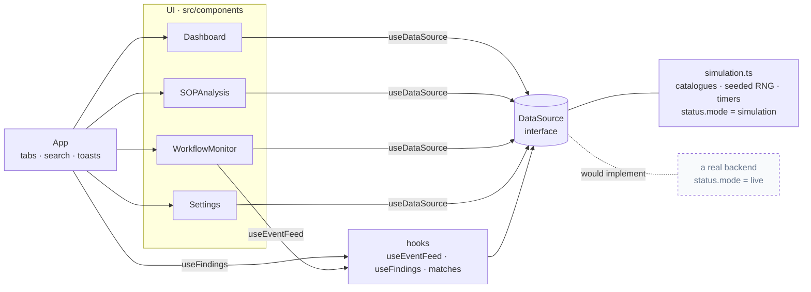
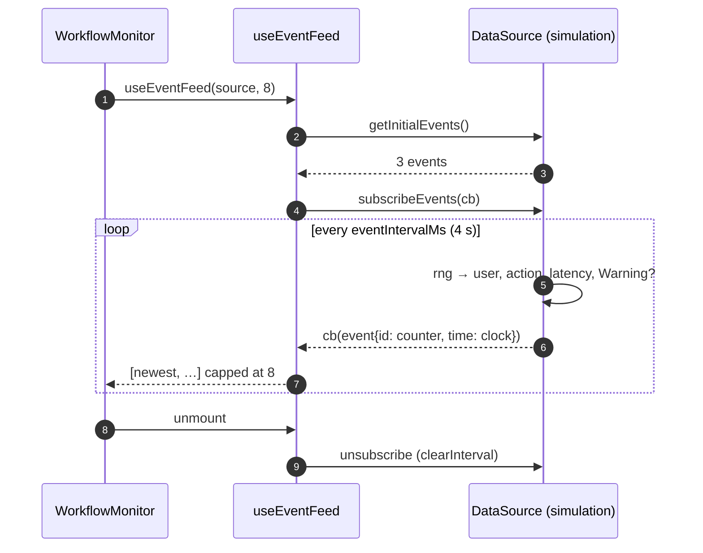

# OpsManager — operations dashboard prototype

[](https://github.com/daniellopez882/AI-Operations-Manager-Agent/actions/workflows/ci.yml)


A front-end prototype of an operations dashboard: an executive overview,
an SOP scoring screen, a live-looking event feed, and a settings page —
React 18, TypeScript, Tailwind, Framer Motion, built with Vite.

> **What it is not.** There is no backend, no model and no integration.
> Every number on screen is generated in the browser by
> [`src/lib/simulation.ts`](src/lib/simulation.ts), and the page says so.
> The previous README described a "24/7 Autonomous Workflow Intelligence
> Platform" with a "real-time perception-action loop"; `package.json` has no
> HTTP client and no model SDK. See [ADR 0002](docs/adr/0002-say-what-it-is.md).

## At a glance

| | |
|---|---|
| **Is** | Four screens of a dashboard UI over a `DataSource` interface whose only implementation is an in-browser simulation |
| **Data seam** | `DataSource` (catalogues + two subscriptions + a `status` that reports `simulation` or `live`) — a backend would implement it; nothing in the UI would change |
| **Tests** | 23 — components rendered with a hand-driven source; the simulation with a seeded generator and fake timers; one test pins "renders without console warnings" |
| **CI** | eslint · `tsc` · vitest · build · bundle-has-no-third-party-URLs check · `npm audit --audit-level=high` · gitleaks · container: non-root, `/healthz`, SPA fallback, CSP and frame headers |

## Architecture



### What happens on the Stream Monitor



## Getting started

```bash
npm ci
npm run dev        # http://localhost:5173
npm test           # vitest
npm run lint && npm run typecheck && npm run build
```

### Container

```bash
docker build -t ops-manager .
docker run --rm -p 8080:8080 ops-manager      # nginx, uid 10001, /healthz
```

`nginx.conf` serves the SPA fallback and sets `Content-Security-Policy`,
`X-Frame-Options`, `X-Content-Type-Options` and `Referrer-Policy`;
`netlify.toml` sets the same headers for Netlify.

## Screens

| Screen | Shows | Controls |
|---|---|---|
| Executive Overview | Four stat cards, bottlenecks, automation suggestions | The search box filters the lists; "Global Scan" is disabled |
| SOP Intelligence | Three procedures with scores; a detail panel | "Simulate audit" is a two-second delay that changes nothing and says so; import/apply are disabled |
| Stream Monitor | A simulated event feed (newest first, capped at 8) and illustrative health figures | "Execute Strategy" is disabled |
| System Config | What a settings page would hold, described truthfully | "Reset Agent" is disabled |

Every disabled control carries the title *Not available in this prototype*.

## What changed, and why

| # | Defect | Effect |
|--:|---|---|
| 1 | README and UI claimed an autonomous AI platform, model hybrids and 15 integrations | None existed; the code makes no network request ([ADR 0002](docs/adr/0002-say-what-it-is.md)) |
| 2 | Catalogues and timers inline in components; ids from `Date.now()` | Untestable; nothing said it was simulated ([ADR 0001](docs/adr/0001-a-data-source-seam.md)) |
| 3 | `AnimatePresence mode="wait"` had two children (the tab view and the toast container) | framer-motion warned *"attempting to animate multiple children … mode is set to wait … odd visual behaviour"* on every render — captured from the original before the change |
| 4 | `"lint": "eslint …"` with no ESLint configuration in the repository | `npm run lint` failed with *couldn't find a configuration file*; unused imports went unnoticed |
| 5 | The grain overlay was `url('https://grainy-gradients.vercel.app/noise.svg')` | Every page load fetched an asset from an unrelated third-party site |
| 6 | Sidebar width `w-68` | Not a Tailwind class; the built CSS had no such rule, so the sidebar had no width |
| 7 | `npm audit`: 10 high advisories in the lockfile | `npm audit fix` and Vite 6 bring it to zero; CI keeps it there |
| 8 | Seven controls looked live and did nothing | Disabled, with a title that says so; the search box now filters |
| 9 | Toast dismissals were `setTimeout`s left running after unmount | Cleared on unmount; the audit delay likewise |
| 10 | README linked `./LICENSE`, which did not exist | Added (MIT) |

## Design notes

| Record | Decision |
|---|---|
| [ADR 0001](docs/adr/0001-a-data-source-seam.md) | A `DataSource` seam; the simulation is its only implementation |
| [ADR 0002](docs/adr/0002-say-what-it-is.md) | The UI and README describe what exists |
| [Threat model](docs/threat-model.md) | Third-party runtime resources, headers, toolchain advisories, container user |

## Layout

```
src/
  App.tsx                 tabs, search, toasts (outside the tab presence)
  components/             Dashboard · SOPAnalysis · WorkflowMonitor · Settings
  lib/data.ts             types and the DataSource interface
  lib/simulation.ts       the in-browser simulation (seeded RNG, injectable clock)
  lib/hooks.ts            useEventFeed · useFindings · matches
  lib/DataSourceContext   provider + hook
  test/                   vitest setup, a hand-driven DataSource harness
nginx.conf · Dockerfile · netlify.toml · .github/workflows/ci.yml · docs/
```

## Limits

- It is a prototype UI. The figures are illustrative and labelled as such.
- Fonts are still loaded from Google Fonts (the one remaining external
  resource; see the threat model).

## Licence

MIT — see [LICENSE](LICENSE).
